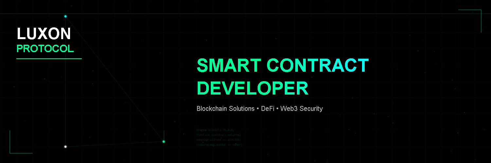

# Luxon Protocol  
**Player-Owned Gaming Infrastructure**

Hey there 👋  
Welcome to the **Luxon Protocol GitHub** 🛠️

This is where contributors, game developers, and protocol builders come together to build the future of **player-owned gaming economies** 🎮🌍

Luxon is built with an open-source mindset and a long-term vision for decentralized, composable game infrastructure. Contributions, ideas, issues, and pull requests are always welcome 💡

We’re excited to grow alongside the Web3 developer and gaming communities, see you around 🚀

---

## 🏗️ About Luxon

**Luxon Protocol** is a blockchain gaming infrastructure provider focused on enabling **true digital ownership**, **on-chain progression**, and **composable game economies**.

Luxon provides reusable, modular smart contract systems that allow game studios and independent developers to build games where:

- Characters are owned by players  
- Stats and progression live on-chain  
- Game economies are transparent and extensible  
- Assets remain useful beyond a single game  

Luxon is designed as a **protocol-level foundation**, not a single game.  
Our demo projects showcase what’s possible when games are built on top of Luxon’s core modules.

---

## 🎮 What We’re Building

Luxon focuses on infrastructure primitives for blockchain games, including:

- **Character systems** (identity & ownership)  
- **On-chain stat engines**  
- **Battle and progression logic**  
- **Economy hooks** (upgrade costs, sinks, burns)  
- **Composable modules** for reuse across games  

Our flagship demo, the **Character Battle Game**, demonstrates how these systems work together to power a player-owned game experience.

---

## 🚀 Getting Started

We’re actively building and iterating.

If you’d like to explore or contribute, start with the repositories below:

- **luxon-demo-game** : Character Battle Game demo built on Luxon  
- **luxon-character-core** : Character identity & ownership module  
- **luxon-stats-engine** : On-chain stat and progression system  
- **luxon-battle-engine** : Deterministic battle logic  
- **docs** : Protocol concepts and developer notes *(coming soon)*  

Each repository contains setup instructions and usage examples.

---

## 🤝 Contributing

Any and all contributions are appreciated ⚡

You can contribute by:
- Opening issues  
- Suggesting improvements  
- Submitting pull requests  
- Testing demo contracts  
- Sharing feedback from real game development  

Luxon aims to grow as a **developer-first ecosystem**.

---

## 🔗 Additional Resources

- GitHub — you’re here  
- X / Twitter — https://x.com/luxonprotocol  
- Documentation — *(coming soon)*  
- Demo walkthrough — *(coming soon)*  
- Community Discord — *(coming soon)*  

If you’re interested in building with Luxon or collaborating, feel free to reach out via GitHub or social channels.

---

## 🌱 Vision

Luxon exists to make player-owned gaming **practical, scalable, and developer-friendly**.

We believe:
- Games should not lock players into closed economies  
- Progression should persist across experiences  
- Infrastructure should be reusable  
- Ownership should be real  

We’re building toward that future — one module at a time.

---
